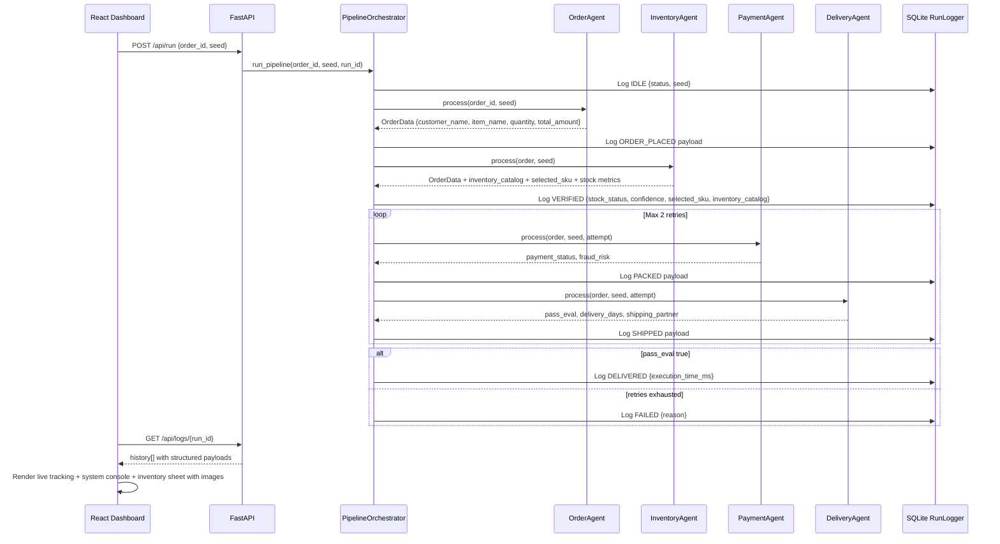

# NovaKart Multi-Agent Order Processing System

NovaKart is a deterministic multi-agent order pipeline that simulates how modern e-commerce platforms process orders from checkout to delivery.

## Overview

The system uses four agents and one orchestrator:
- `OrderAgent`: creates the order context from selected dataset input.
- `InventoryAgent`: validates stock confidence and now manages an inventory catalog payload (with product images and SKU metadata).
- `PaymentAgent`: verifies payment and fraud risk with retry-aware logic.
- `DeliveryAgent`: evaluates pass/fail criteria, assigns shipping partner, and estimates delivery window.
- `PipelineOrchestrator`: enforces ordered state transitions and structured message logging.

## State Machine

`IDLE -> ORDER_PLACED -> VERIFIED -> PACKED -> SHIPPED -> DELIVERED | FAILED`

Every transition is logged through a strict JSON protocol.

## Architecture Interaction Diagram



## Core Features

- Multi-agent separation with explicit responsibilities.
- Deterministic seeded execution for reproducible evaluations.
- SQLite-backed transition history (`runs.db`) for observability.
- Premium React dashboard with:
  - Live stage handoff transitions.
  - System console with protocol logs and metrics.
  - Inventory sheet view (image cards, stock badges, SKU selection context) driven by `InventoryAgent` payload.

## Message Protocol

All run events follow:

```json
{
  "run_id": "uuid",
  "agent": "InventoryAgent",
  "state": "VERIFIED",
  "order_id": "1",
  "payload": {},
  "timestamp": "UTC datetime"
}
```

## API Endpoints

- `POST /api/run`
  - Body: `{ "order_id": "1", "seed": 42 }`
  - Starts an asynchronous run and returns `run_id`.
- `GET /api/logs/{run_id}`
  - Returns full ordered transition history for the run.

## Technology Stack

- Backend: Python, FastAPI, Pydantic
- Frontend: React + TypeScript + Vite
- Storage: SQLite (`runs.db`)

## Getting Started

### 1. Start Backend

```bash
pip install fastapi uvicorn pydantic
python run.py
```

### 2. Start Frontend

```bash
cd demo-app
npm install
npm run dev
```

### 3. Run a Scenario

- Select order dataset and seed in the UI.
- Click `Process Order`.
- Watch stage transitions, inventory sheet data, metrics, and protocol logs update in real time.

## Project Docs

- Architecture: `docs/architecture.md`
- Interaction Diagram: `docs/interaction_diagram.md`
- Evaluation Report: `docs/evaluation_report.md`
