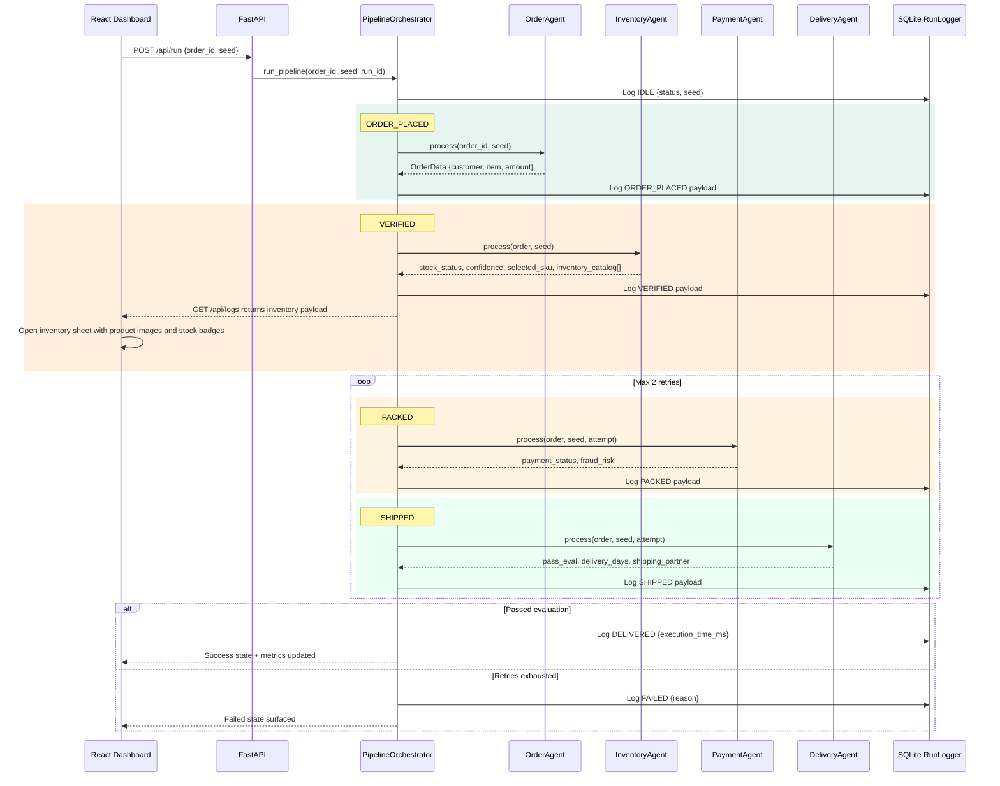

# NovaKart Architecture Interaction Diagram

```mermaid
sequenceDiagram
    participant UI as React Dashboard
    participant API as FastAPI
    participant Orch as PipelineOrchestrator
    participant OrderA as OrderAgent
    participant InvA as InventoryAgent
    participant PayA as PaymentAgent
    participant DelA as DeliveryAgent
    participant DB as SQLite RunLogger

    UI->>API: POST /api/run {order_id, seed}
    API->>Orch: run_pipeline(order_id, seed, run_id)

    Orch->>DB: Log IDLE {status, seed}

    rect rgb(230, 245, 240)
    Note over Orch: ORDER_PLACED
    Orch->>OrderA: process(order_id, seed)
    OrderA-->>Orch: OrderData {customer, item, amount}
    Orch->>DB: Log ORDER_PLACED payload
    end

    rect rgb(255, 239, 222)
    Note over Orch: VERIFIED
    Orch->>InvA: process(order, seed)
    InvA-->>Orch: stock_status, confidence, selected_sku, inventory_catalog[]
    Orch->>DB: Log VERIFIED payload
    Orch-->>UI: GET /api/logs returns inventory payload
    UI->>UI: Open inventory sheet with product images and stock badges
    end

    loop Max 2 retries
        rect rgb(255, 244, 226)
        Note over Orch: PACKED
        Orch->>PayA: process(order, seed, attempt)
        PayA-->>Orch: payment_status, fraud_risk
        Orch->>DB: Log PACKED payload
        end

        rect rgb(236, 255, 245)
        Note over Orch: SHIPPED
        Orch->>DelA: process(order, seed, attempt)
        DelA-->>Orch: pass_eval, delivery_days, shipping_partner
        Orch->>DB: Log SHIPPED payload
        end
    end

    alt Passed evaluation
        Orch->>DB: Log DELIVERED {execution_time_ms}
        Orch-->>UI: Success state + metrics updated
    else Retries exhausted
        Orch->>DB: Log FAILED {reason}
        Orch-->>UI: Failed state surfaced
    end
```
